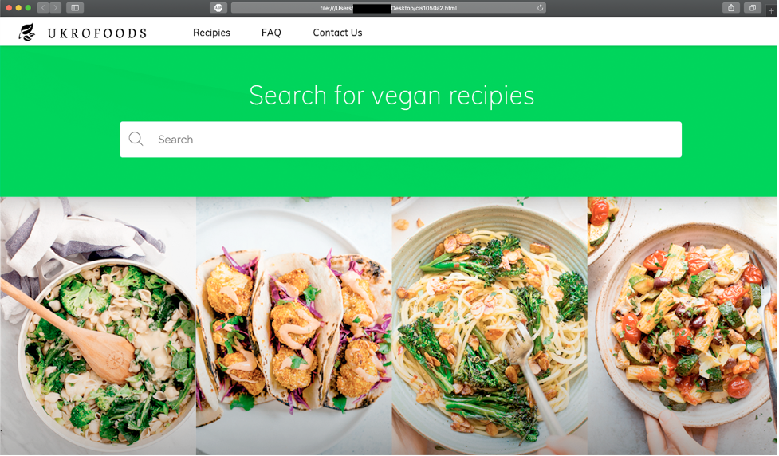

# Vegan-Webpage
Frontend design for a company that promotes a vegan lifestyle

Project Summary:
This is a project I made to work on my skills in UX design. The challenge I gave myself for this project was to design a website using Photoshop, then architect it
with HTML and CSS. I decided I wanted to sharpen my skills in CSS so I tasked myself to not use any responsive web design frameworks (Bootstrap, Foundation, ect).
I also did this so I could have more creativity when designing the webpage in Photoshop. 

Tools Used: HTML, CSS, and Photoshop

